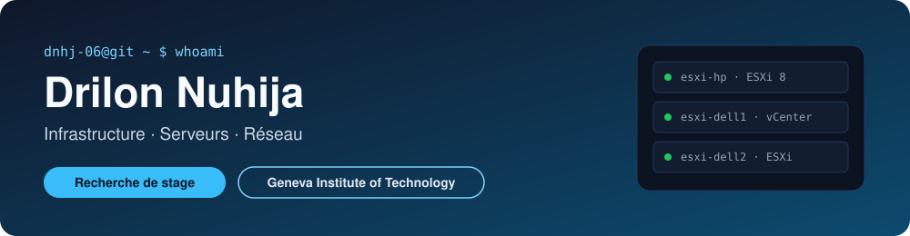

  
  

---

### 👋 En quelques mots

Étudiant en première année de CFC d'informaticien au **Geneva Institute of Technology**, à Genève.

Pour l'instant, ce qui m'intéresse le plus c'est le réseau et tout ce qui touche aux serveurs.

Avant de me lancer dans l'informatique, j'ai passé trois ans dans le commerce : vente, stock, commandes, gestion du magasin. C'est d'ailleurs pour ce magasin que j'ai codé ma première vraie appli.

> Chaque projet a sa propre doc : étapes, captures d'écran, problèmes rencontrés et comment je les ai réglés.

---

### 🎯 Ce que je recherche

| | |
|---|---|
| **Type** | Stage |
| **Domaines** | Réseau · Serveurs · Support informatique |
| **Lieu** | Entre Genève et Lausanne |
| **Contact** | [drilon.nuhija@git.swiss](mailto:drilon.nuhija@git.swiss) · [mon CV](https://dnhj-06.github.io) |

---

### 🚀 Projets

| Projet | Ce que j'ai fait | Technos |
|---|---|---|
| 🖥️ [Infrastructure VMware en équipe](https://github.com/dnhj-06/cluster-vsphere) | 3 serveurs physiques sous ESXi montés à 4, vCenter (VCSA 6.5), domaine Active Directory, problèmes de stockage et de compatibilité réglés sur du vieux matériel | `ESXi` `vCenter` `Windows Server` `AD` |
| 💻 [Mise en service d'un poste](https://github.com/dnhj-06/ppe-projects/tree/main/projet-1-fiche-mise-en-service) | Installation et configuration d'un poste pour un cabinet comptable | `Windows` |
| 👥 [Poste multi-utilisateurs](https://github.com/dnhj-06/ppe-projects/tree/main/projet-2-poste-multi-utilisateurs) | Poste partagé pour une salle informatique, avec profils utilisateurs séparés | `Windows` |
| 💾 [Migration et sauvegarde](https://github.com/dnhj-06/ppe-projects/tree/main/projet-3-migration-sauvegarde) | Migration et sauvegarde des données d'un poste existant | `Windows` |
| 🔧 [Dépannage et diagnostic](https://github.com/dnhj-06/ppe-projects/tree/main/projet-4-depannage-diagnostic) | Diagnostic et résolution d'une panne sur un poste de travail | `Windows` |
| 📦 [Déploiement standardisé](https://github.com/dnhj-06/ppe-projects/tree/main/projet-5-deploiement-standardise) | Déploiement d'un poste à partir d'une image système | `Windows` |
| 📊 Appli d'inventaire *(repo privé)* | Appli web pour gérer le stock d'un commerce | `Firebase` `Vercel` |

<!-- Pour ajouter un projet : copier une ligne du tableau au-dessus et la modifier -->

---

### 🗺️ L'infra du projet VMware

---

### 🧰 Stack

**Virtualisation** 

**Systèmes** 

**Outils** 

---

### 🌍 Langues

🇫🇷 Français : langue maternelle · 🇦🇱 Albanais : langue maternelle · 🇬🇧 Anglais : B2 (certificat)
