<p align="center">
  <a href="https://dnhj-06.github.io"></a>
  <a href="mailto:drilon.nuhija@git.swiss"></a>
</p>

## ⚡ Qui je suis

Étudiant en première année de CFC d'informaticien au **Geneva Institute of Technology**, à Genève.

Pour l'instant, ce qui m'intéresse le plus c'est le réseau et tout ce qui touche aux serveurs.

Avant de me lancer dans l'informatique, j'ai passé trois ans dans le commerce : vente, stock, commandes, gestion du magasin. C'est d'ailleurs pour ce magasin que j'ai codé ma première vraie appli.

**Je cherche un stage** en réseau, serveurs ou support informatique, entre Genève et Lausanne.

## 🛠️ Mes projets

> ✅ terminé · 🔄 en cours · chaque projet a sa doc avec les étapes, les captures et les problèmes réglés

**🔄 [Infrastructure VMware en équipe](https://github.com/dnhj-06/cluster-vsphere)** · `ESXi` `vCenter` `Windows Server` `Active Directory`<br>
3 serveurs physiques montés à 4 sur du vieux matériel, vCenter (VCSA 6.5), domaine AD, problèmes de stockage et de compatibilité réglés.

<details>
<summary>Voir le schéma de l'infra</summary>
<br>

</details>

**✅ [Projets PPE · IT Essentials](https://github.com/dnhj-06/ppe-projects)** · `Windows`<br>
5 projets sur des postes de travail :
[mise en service](https://github.com/dnhj-06/ppe-projects/tree/main/projet-1-fiche-mise-en-service) ·
[multi-utilisateurs](https://github.com/dnhj-06/ppe-projects/tree/main/projet-2-poste-multi-utilisateurs) ·
[migration et sauvegarde](https://github.com/dnhj-06/ppe-projects/tree/main/projet-3-migration-sauvegarde) ·
[dépannage](https://github.com/dnhj-06/ppe-projects/tree/main/projet-4-depannage-diagnostic) ·
[déploiement par image](https://github.com/dnhj-06/ppe-projects/tree/main/projet-5-deploiement-standardise)

**🔄 Appli d'inventaire** · `Firebase` `Vercel` · *repo privé*<br>
Appli web pour gérer le stock d'un commerce. En cours : import automatique des factures par IA.

<!-- Pour ajouter un projet : copier un bloc au-dessus (titre en gras + une ligne de description) -->

## 🧭 Mon parcours

```
2019 ─ 2022   ECG Madame de Staël              certificat de culture générale
2022 ─ 2023   ECGAD                            complément de formation
2023 ─ 2026   Commerce (tabac-journaux)        vente, stock, gestion du magasin
2026 ─ ...    Geneva Institute of Technology   CFC d'informaticien  ◀ maintenant
```

## 🔧 Ce que j'utilise


## 🌍 Langues

Français et albanais (langues maternelles) · Anglais B2 (certificat)

<sub>Hors écran : sport, voitures, jeux vidéo et montage de PC.</sub>
